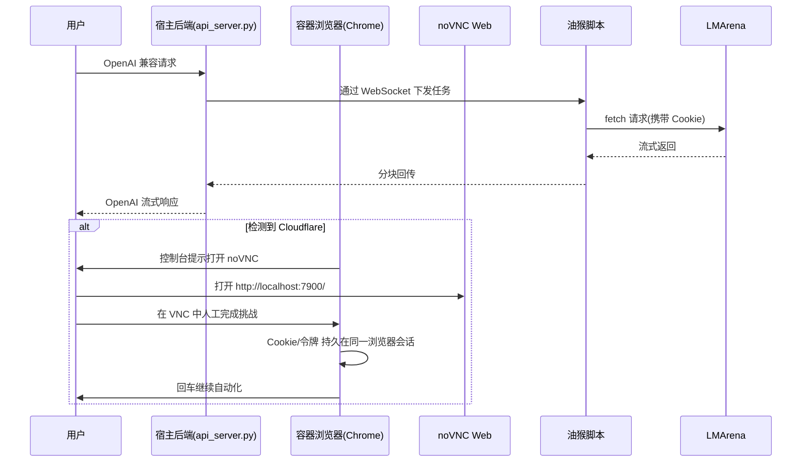

# 开发者文档（dev.md）

本文件面向开发者，重点阐述 Cloudflare 验证处理的原理与实现，同时说明浏览器自动化、脚本注入、网络连通与安全模型。

目录
- Cloudflare 验证原理与本项目策略
- 架构与数据流
- 实现细节（关键模块）
- 为什么必须“同一浏览器实例”完成验证
- 安全与权限边界
- 常见问题与排障
- 扩展建议

## Cloudflare 验证原理与本项目策略

LMArena 使用 Cloudflare 的人机验证与访问保护（含 Turnstile/Challenge Platform 等）。其核心点：
- 浏览器端需要完成一系列挑战（JS 计算、行为、验证码等），成功后通常下发短期有效的令牌和/或 Cookie（常见为 `cf_clearance`），并与浏览器指纹、会话上下文绑定。
- 令牌验证发生在目标域名的后端与边缘节点，通常与本机 IP、User-Agent、指纹、TLS 指纹等信息组合校验，难以在纯 HTTP 客户端层面“伪造”。

本项目不尝试“绕过/破解”Cloudflare，而是通过以下策略确保“合法、可操作、可维护”：
- 在容器中运行一个真实的 Chrome 实例，由 Selenium 控制；当检测到 CF 挑战时，切换到同一实例的 noVNC 网页端，让用户在浏览器里“亲自”完成挑战。
- 验证成功后，相关令牌/Cookie 会保存在“同一浏览器配置目录”。因为我们始终使用同一进程与会话，所以后续自动化即可继承该状态，继续访问受保护资源。
- 整个过程不修改网站协议，不尝试模拟私有算法，仅做“检测→提示→人工完成→恢复自动化”的流程编排。

相关代码：
- 引导器（容器+noVNC+注入+检测）：[scripts/docker_browser_runner.py](scripts/docker_browser_runner.py)
- 后端（WS/HTTP 中继与任务编排）：[api_server.py](api_server.py)
- ID 捕获服务（5103）：[id_updater.py](id_updater.py)
- 油猴脚本（自动化前端桥）：[TampermonkeyScript/LMArenaApiBridge.js](TampermonkeyScript/LMArenaApiBridge.js)
- Compose（常驻容器浏览器）：[docker-compose.yml](docker-compose.yml)

## 架构与数据流

## 实现细节（关键模块）

### 1) 容器化浏览器与 noVNC
- 我们选用官方镜像 `selenium/standalone-chrome` 暴露 4444(WebDriver) 与 7900(noVNC)。
- 通过一键脚本或 Compose 启动：
  - Windows 脚本：[run_docker_browser.bat](run_docker_browser.bat)
  - Compose 清单：[docker-compose.yml](docker-compose.yml)
- 共享内存 `--shm-size=2g` 以改善稳定性；必要时可挂载配置目录以持久化会话（详见 README）。

### 2) WebDriver 连接与 Userscript 注入
- 引导器通过 Remote WebDriver 连接容器，并使用 CDP 的 `Page.addScriptToEvaluateOnNewDocument` 在 `document_start` 时注入用户脚本。
- 注入前做两件事：
  1) 将脚本中 `localhost/127.0.0.1` 统一改写为 `host.docker.internal`（容器→宿主的回连）。
  2) 包一层域名守卫 IIFE，仅在 `*.lmarena.ai` 执行，避免影响其他网站。
- 允许混合内容与本地证书的关键 Chrome 参数：
  - `--disable-web-security`
  - `--allow-running-insecure-content`
  - `--ignore-certificate-errors`
  - `--allow-insecure-localhost`
  - `--disable-features=BlockInsecurePrivateNetworkRequests`

代码位置：
- 引导器：[scripts/docker_browser_runner.py](scripts/docker_browser_runner.py)
- 用户脚本源：[TampermonkeyScript/LMArenaApiBridge.js](TampermonkeyScript/LMArenaApiBridge.js)

### 3) Cloudflare 挑战检测与 noVNC 切换
- 检测方式（启发式）：
  - HTML 中包含 `cloudflare`/`challenge-platform`/`cf-chl`/`turnstile` 等关键字
  - 页面存在以下选择器：`iframe[src*='challenges.cloudflare.com']`、`[class*='cf-challenge']`、`[data-sitekey]`、`#challenge-form`
- 流程：
  1) 导航目标页 → 进行上述检测
  2) 若命中：在控制台打印 noVNC URL，请用户在网页端完成挑战
  3) 用户返回控制台按回车，二次检测；通过则继续自动化
- 该方案的核心是“同一浏览器实例+同一配置目录”，确保挑战生成的 Cookie/令牌被后续自动化复用。

### 4) 与后端通信与业务执行
- 油猴脚本通过 WebSocket 连接宿主后端（`ws://host.docker.internal:5102/ws`），接收任务并向 LMArena 发起真实请求。
- 请求/响应为流式中继，服务器端负责与 OpenAI 兼容协议互转、拼装/拆分消息块。
- 图像能力自动识别：由工具脚本 [use-model.py](use-model.py) 从 `available_models.json` 生成 [models.json](models.json)，含 `:image` 后缀。

## 为什么必须“同一浏览器实例”完成验证

- Cloudflare 的令牌发放通常绑定浏览器指纹、TLS、IP 与挑战会话；令牌以 Cookie（如 `cf_clearance`）或内存 token 的形式留在浏览器侧。
- 若使用“不同进程/不同配置目录”的浏览器去请求，极可能被判为未验证状态，需要重新挑战。
- 本项目通过 Selenium 控制的“同一 Chrome 实例 + 同一用户数据目录（默认镜像内置路径）”完成挑战并继续脚本化访问，避免状态丢失。
- 若需跨重启保留状态，请在 [docker-compose.yml](docker-compose.yml) 中挂载浏览器配置与缓存卷（参考 README 的示例）。

## 安全与权限边界

- 注入脚本仅在 `*.lmarena.ai` 域生效；不要扩展到泛域名，以免被恶意页面利用本地桥。
- 允许混合内容与本地回连会降低浏览器同源/私网保护，默认仅用在“开发/本地”网络环境；生产部署请在受信网络或网关内使用，并考虑反代为 HTTPS。
- 宿主端口 5102/5103 为本地桥接口，应限制为 `127.0.0.1` 监听；如因容器连通需要开放到局域网，务必在防火墙与 API Key 上做好访问控制。
- 绝不在代码中尝试规避 Cloudflare 的验证逻辑（例如伪造指纹/反编译密钥等），这既不稳定也可能违约。

## 常见问题与排障

1) noVNC 打不开/空白
- 确认容器 `lm_cf_browser` 在运行，端口 7900 未被占用
- 企业代理/安全策略可能拦截 WebSocket；尝试换网络或本地直连

2) Userscript 无“✅”标记
- 说明与宿主后端 WS 连接未成功。检查后端监听 `http://127.0.0.1:5102`，并确认注入已执行
- Windows/Mac 使用 `host.docker.internal` 默认可达；Linux 下需在 Compose 中配置 `extra_hosts: host-gateway`

3) 一直提示 Cloudflare
- 在 noVNC 页面中刷新（F5）并完整完成验证
- 若网络出口频繁变更（代理切换/IP 漂移），Cloudflare 可能重新触发人机
- 可考虑在 Compose 中持久化浏览器目录，减少重建容器导致的会话丢失

4) 本地回连失败（容器→宿主）
- 确认宿主防火墙允许 5102/5103 本地入站
- Linux 引擎请使用 `extra_hosts: "host.docker.internal:host-gateway"`

## 扩展建议

- 自动打开 noVNC：在检测到 CF 后由引导器调用系统浏览器打开 `http://localhost:7900/...`（目前出于简化未自动打开）。
- 监听 Cookie 变化：在 Selenium 端轮询或通过 CDP 读取 Cookie，若检测到 `cf_clearance` 更新则自动继续，无需回车确认。
- 用户数据目录持久化：在 [docker-compose.yml](docker-compose.yml) 中启用卷挂载，保持登录态与验证状态长期有效。
- 更稳健的挑战判定：结合网络响应状态码、标题与特征脚本三元判定，降低误报/漏报。

---

变更点快速索引（文件级）
- 容器浏览器引导器：[scripts/docker_browser_runner.py](scripts/docker_browser_runner.py)
- 后端服务与 WS 协议：[api_server.py](api_server.py)
- 油猴脚本（页面自动化与桥接）：[TampermonkeyScript/LMArenaApiBridge.js](TampermonkeyScript/LMArenaApiBridge.js)
- 一键脚本（Windows）：[run_docker_browser.bat](run_docker_browser.bat)
- Compose 清单：[docker-compose.yml](docker-compose.yml)
- 模型清单生成器：[use-model.py](use-model.py)

本文档仅描述原理与实现，不包含任何规避或攻击性技术；整套流程以“人工在可视界面完成 Cloudflare 挑战”为前提，后续自动化仅承接已获授权的访问状态。